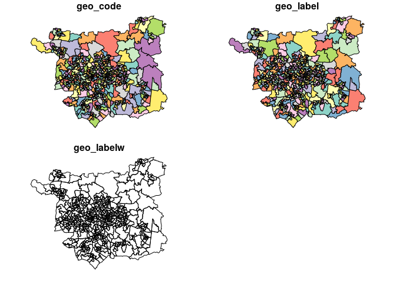

<!-- README.md is generated from README.Rmd. Please edit that file -->

# Introduction

The goal of scities is to provide teaching materials for the Digital
Methods workshop as part of the Sustainable Cities Masters at the
University of Leeds.

In-line with the content, these materials were developed using new
digital methods. This file was generated using an ‘RMarkdown’ file:
`README.Rmd`. Why this file format instead of something like `README.md`
or (worse) `README.docx`? Because you can include R chunks like this:

``` r
d = Sys.Date()
msg = "Welcome to the digital methods workshop on "
print(paste0(msg, d))
#> [1] "Welcome to the digital methods workshop on 2018-09-28"
```

The date automatically changes each time we build (‘compile’) the
document. Automation is an important concept in digital methods. It’s
also practically useful. Automation saves time\!

This document is also reproducible, which is vital for democratically
accountable and transparent decision-making. But it depends on some
software to be reproduced: a recent version of R must be installed. Then
from within R you must install some packages. Entering these commands
into the ‘R terminal’ will install them for you:

``` r
pkgs = c(
  "osmdata",   # for working with open street map data
  "sf",        # a package for working with spatial data
  "stplanr",   # a transport data package
  "tidyverse", # metapackage for data science
  "tmap"       # a mapping package
)

pkgs_installed = pkgs %in% installed.packages()
names(pkgs_installed) = pkgs
pkgs_installed
#>   osmdata        sf   stplanr tidyverse      tmap 
#>      TRUE      TRUE      TRUE      TRUE      TRUE
if(!all(pkgs_installed)) {
  install.packages(pkgs[!pkgs_installed])
}
```

``` r
devtools::install_github("robinlovelace/ukboundaries")
```

You can check these have been installed properly with the following
commands:

``` r
library(sf)
library(stplanr)
library(tidyverse)
```

## spatial data

Cities are spatial entities so you should know some GIS concepts before
grappling with city data. The introductory comments of Chapter 2 in the
open source and open access book [Geocomputation with
R](https://geocompr.robinlovelace.net/spatial-class.html) provide an
overview of spatial data models.

For more in-depth information, you can read sections
[2.2.5](https://geocompr.robinlovelace.net/spatial-class.html#geometry)
and (for ‘raster’ data)
[2.3](https://geocompr.robinlovelace.net/spatial-class.html#raster-data)
of the same resource. We encourage you to search-for other resources on
spatial data: there’s lots out there and, like everything in digital
methods, is rapidly evolving\!

## Data sources

traditional (eg census) and new (eg open street map)

Traditional city/transport planning uses official datasets. An example
of this is official zoning systems, such as the ‘LSOA’ zones loaded and
plotted below:

``` r
zones_leeds = ukboundaries::lsoa2011_lds
#> Using default data cache directory ~/.ukboundaries/cache 
#> Use cache_dir() to change it.
plot(zones_leeds)
```

<!-- -->

Unofficial datasets, such as those provided by the OpenStreetMap project
are messier but in some cases richer. An exmaple is provided below,
which downloads and plots parks in Leeds:

``` r
# ...
```

## bringing data together in a spatial coding environment

Then in the practical, by way of example of the issues raised int he
lecture, we will develop something that looks at where new cycle routes
could be developed in Leeds \#\# looking at travel to work patterns in
Leeds (formal census data)

## where cycling is supported by cycling routes (OSM data)

## then identify areas that would benefit from additional cycling routes

## we may even suggest potential routes\!
