An Introduction Digital (spatial data) Methods
================
Lex Comber and Robin Lovelace

<!-- README.md is generated from README.Rmd. Please edit that file -->

# 1\. Introduction

The goal of scities is to provide teaching materials for the Digital
Methods workshop as part of the Sustainable Cities Masters at the
University of Leeds.

In-line with the content, these materials were developed using new
digital methods. This file was generated using an ‘RMarkdown’ file:
`README.Rmd`. Why this file format instead of something like `README.md`
or (worse) `README.docx`? Because you can include R chunks like this:

``` r
d = Sys.Date()
msg = "Welcome to the digital methods workshop on "
print(paste0(msg, d))
#> [1] "Welcome to the digital methods workshop on 2018-11-23"
```

The date automatically changes each time we build (‘compile’) the
document. Automation is an important concept in digital methods. It’s
also practically useful. Automation saves time\!

This document is also reproducible, which is vital for democratically
accountable and transparent decision-making.

## 1.1 Getting started

This session sets up the main session in the rest of the workshop.

The aims of this session are to

1.  Make sure you can access RStudio on your computer
2.  Go through any queries or questions you have from the introductory
    materials in *Session 0*
3.  Provide you with the basic tools to get you started with R.

If have already worked through the Owen Guide
(<https://cran.r-project.org/doc/contrib/Owen-TheRGuide.pdf> up to page
38) in advance of this training, then this session should be a useful
refresher. If this is the first time that you have used R / RStudio then
naughty, naughty for not doing your homework, but you should be able to
get up to speed.

This session will cover a number of specific but key activities:

  - R packages
  - saving workspaces and projects
  - using scripts
  - loading data
  - simple visual data exploration (basic boxplots, histograms)
  - summary statistics

## 1.2 Why use R

R was initially developed by Robert Gentleman and Ross Ihaka of the
Department of Statistics at the University of Auckland. R is
increasingly becoming the default software package in many areas of
science. There are a number of reasons for this:

  - R includes a very large number of tools, functions and packages
      - packages are libraries of tools
      - packages are written by scientists in different subject areas
  - R has the latest methods and tools
  - New tools are in R 10-20 years ***before*** commercial software
      - e.g. GWR was around for 10 years before being in ArcGIS
  - The tools in R are open (i.e. the source code is visible)
      - you can see exactly what is being done
      - most commercial tools are hidden - *black boxes*
  - R is free\!

For these reasons R is becoming widely used in many areas of scientific
activity and quantitative research.

## 1.3 RStudio

RStudio is an IDE for R. Basically this means it makes using R easier,
with various windows and clever code-autocompletion that makes writing R
code quicker. An introdcton to geting started in R/RStdio can be found
at <https://rpubs.com/chrisbrunsdon/UQ_rbasics> - this will explain how
to install R / RStudio and critically specific packages with specific
functionality (eg for reading spatial data, making maps etc).

R and RStudio can be downloaded from the CRAN website and installed your
own computer: - R for PCs:
<https://cran.r-project.org/bin/windows/base/> - R for Macs:
<https://cran.r-project.org/bin/macosx/> - RStudio:
<https://www.rstudio.com/products/rstudio/download/#download> You should
install R before you install RStudio. RStudio is user friendly interface
to R. All of the code you write (and in this workshop) will run in both
environments. Here it assumed that you are using RStudio.

## 1.4 Working in R / RStudio

There are 2 key points about working in R

1.  When working in R, either writing your own code or copy and pasting
    from these materials, you *should* write the code into a script or
    document. Go to **File \> New File \> R Script** to open a new R
    file.

The reasons for this are so that you get used to using the R console and
running the code will help your understanding of the code’s
functionality. Then in order to run the code in the R console,a quick
way to enter it is to highlight the code (with the mouse or using the
keyboard controls) and the press `ctrl-R` or `cmd-Enter` on a Mac.

You are not expected to type all the code in - you should be able to
copy and paste from the worksheet: this is not a typing course\!

2.  Learning is R is learning to drive. You may pass your test but ti
    become a good driver it is time behind the wheel that counts. The
    importance of *learning by doing* and getting your hands dirty
    cannot be overstated. Some of the code might look a bit fearsome
    when first viewed, especially in later session BUT the only really
    effective way to understand it is to give it a try.

A further minor point is that in the code comments are prefixed by \(#\)
and are ignored by R when entered into the console. You should remember
to write your code and add annotations or comments using the `#` symbol
- you will see these in the code snippets below. These will help you
understand your code and what you did when come back to it later.

If you have worded your way through the Owen Guide
(<https://cran.r-project.org/doc/contrib/Owen-TheRGuide.pdf> up to page
38) then you will have come across a few things that will be re-capped
here:

1.  Assignment: this is the basic process of giving R objects values

<!-- end list -->

``` r
vals <- c(4.3,7.1,6.3,5.2,3.2,2.1)
```

2.  Operations: having assigned values to object that can be manipulated

<!-- end list -->

``` r
vals*2
#> [1]  8.6 14.2 12.6 10.4  6.4  4.2
sum(vals)
#> [1] 28.2
mean(vals)
#> [1] 4.7
```

3.  Indexing: individual elements of R objects with multiple data
    elements can be referred to:

<!-- end list -->

``` r
vals[1]    # first element
#> [1] 4.3
vals[1:3]   # a subset of elements 1 to 3
#> [1] 4.3 7.1 6.3
sqrt(vals[1:3]) #square roots of the subset
#> [1] 2.073644 2.664583 2.509980
vals[c(5,3,2)]  # a subset of elements 5,3,2 - note the ordering
#> [1] 3.2 6.3 7.1
```

4.  There are many different data types in R: character, logical,
    integer etc - too many to cover here.

5.  There are many different data classes in R: Vectors, Matrices,
    Factors, Lists

## 1.5 R packages

When you install R / RStudio it comes with a large number of tools
already (referred to as *base functionality*).

However, one of the joys of R, is the community of users. Users share
what they do and create in R in a number of ways. One of these is
through packages. Packages are collections of related functions that
have been created, tested and supported with help files. These are
bundled into a package and shared with other R users via the that users
can download from the CRAN repository.

There are 1000s of packages in R. These contain set of tools and can be
written by anyone. The number of packages is continually growing. When
packages are installed these can be called as libraries. The background
to R, along with documentation and information about packages as well as
the contributors, can be found at the R Project website
<http://www.r-project.org>.

Packages can be found at the CRAN website -
<https://cran.r-project.org/web/packages/>:

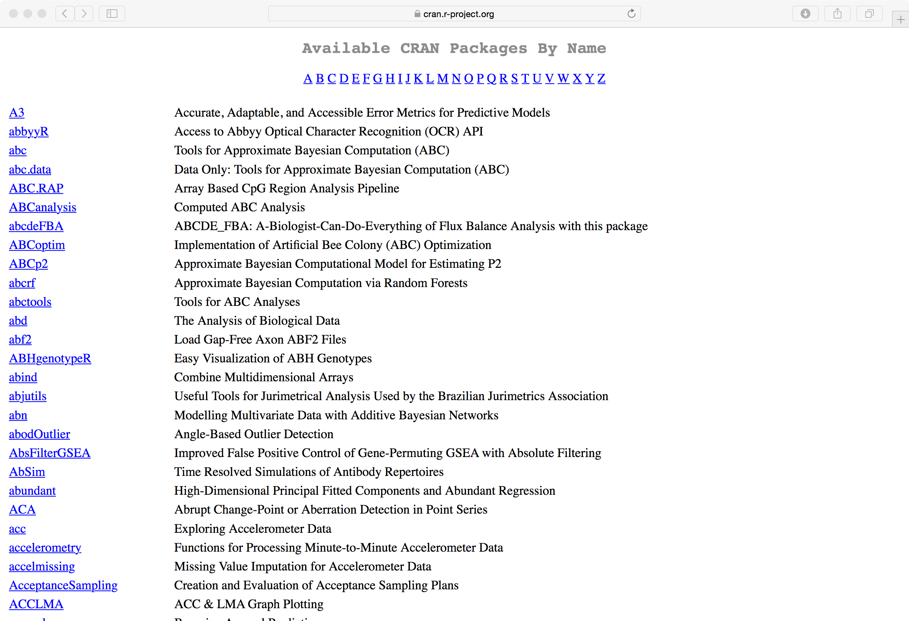

Users install the package once to mount it on their computer, and then
it can be called in R scripts as required.

The basic operations are

1.  install the package before the first time it is used
      - you may have to set a mirror site the fist time you install a a
        package
      - **this is only done once**
2.  load the package using the `library` function to use the package
    tools
      - **this is done for each R session**

So a typical way to do this is to eneter something similar to the below

``` r
install.packages("<package name>", dep = TRUE)
```

Or you can either use the RStudio menu  

**Tools \> Install Packages…**

To install the `tidyverse` enter:

``` r
install.packages("tidyverse", dep = TRUE)
```

Note you may have to respond to the request from R / RStudio to set a
mirror - a site from which to download the package - pick the nearest
one\!

This loads a number of packages in - the tidyverse is a wrapper for many
packages and functions - hence the need for `dep = TRUE` parameter in
the `install.packages()` function above. The `tidyverse` - see
<https://www.tidyverse.org> - is a collection of R packages designed for
data science. We all live in the tidyverse now….\!

As well as `tidyverse`,i n this workshop we will use a number of
packages that you will need to install as we go through the sessions.
You should install the following packages and load them in the same way,
for example by running the following code chunk:

``` r
pkgs = c(
  "sf",        # a package for working with spatial data
  "tmap",      # a mapping package
  "osmdata",   # for working with open street map data
  "stplanr",   # a transport data package
  "tidyverse", # metapackage for data science
  "reshape2",  # for reformating/'shaping' data
  "rgeos"      # an R interface to geos, similar to sf
)
```

``` r
# install.packages(pkgs)
```

    #>        sf      tmap   osmdata   stplanr tidyverse  reshape2     rgeos 
    #>      TRUE      TRUE      TRUE      TRUE      TRUE      TRUE      TRUE

Once installed, the packages do not need to installed again for
subsequent use. The can simply be called using the `library` function.
Load packages at the start of your R session or scripts as follows:

<!-- -->

You can also install packages from GitHub to get the most up-to-date
versions or packages not on CRAN (be warned: GitHub packages may not be
high quality and can be a pain to install/use\!). The following command,
for example, installs a package that gives you quick access to some
administrative zone datasets in the UK:

``` r
devtools::install_github("robinlovelace/ukboundaries")
```

## 1.6 Spatial data

Cities are spatial entities so you should know some GIS concepts before
grappling with city data. The introductory comments of Chapter 2 in the
open source and open access book [Geocomputation with
R](https://geocompr.robinlovelace.net/spatial-class.html) provide an
overview of spatial data models.

In brief, real-world discrete geographic features are represented in
spatial databases using vectors of points, lines and areas. For example,
point to represent a shop, address or postcode location, lines for
linear features such roads and areas for things likes parks, zones,
building outlines etc. Continuous features (eg temperature surfaces) are
frequently repsented by gridded or raster data. The *spatial* objects
provide a framework for hanging information or *attributes* about these
features. This could be the number of people living in each house, the
area of a park, the opening times of a shop etc, and each object can
have multiple attributes that are usually held in some form data table.
Thus a spatial database holds information about the location and extent
of geographic features and their properties or *attributes*.

There are 1000s of R packages and the `sf` (Simple Features) package
provides formats for spatial dat aand their analysis. The `sf` vignette
provides an introduction to vector data and formal descriptions of
spatial formats:
<https://cran.r-project.org/web/packages/sf/vignettes/sf1.html>

# 2\. Data sources and data import

You will be provided with all the materials you need to do this
practical work. Then later, in your own time, if you are interested in
developing these skills further…..there are a number of further reources
that you may find useful:

  - To get started with spatial data in R have a look at the practical
    at <https://rpubs.com/lexcomber/session4>.
  - For more in-depth information, you can read sections
    [2.2.5](https://geocompr.robinlovelace.net/spatial-class.html#geometry)
    and (for ‘raster’ data)
    [2.3](https://geocompr.robinlovelace.net/spatial-class.html#raster-data)
    of the same resource.
  - There is an excellent introductory text on spatial analysis and
    mapping in R:
    <https://uk.sagepub.com/en-gb/eur/an-introduction-to-r-for-spatial-analysis-and-mapping/book258267>
    2nd edition coming in December 2018\!
  - More advanced methods for manipulating spatial data can be found in
    Bivand et al (2008) see
    <http://gis.humboldt.edu/OLM/r/Spatial%20Analysis%20With%20R.pdf>
    (this assumes you know what you want to do)

We encourage you to search-for other resources on spatial data: there’s
lots out there and, like everything in digital methods, is rapidly
evolving\!

**Key point**: spatial data describe the location and outline where
appropriate of real-world geographic features. The *attribites* of
individual features are held in some form of data table (similar to a
spreadsheet).

## 2.1 Traditional data (population census etc)

Traditional city/transport planning uses official datasets. There are
many sources of spatial data and it is impossibel to list all of them.
Much geographic or spatial data about cities is provided by the
population census, conducted every 10 years. This summarises individual
household census returns to geographic areas - you may have heard of
Wards, but data can be obtained for a number of different geographies
from Output Area (small, about 300 people) to countries (large) via,
Lower Super Output Areas (~1500 people), Medium Super Output Areas
(~7500 people), local authorities, countes and unitary authorities and
regions.

In the UK, census data for these areas can be easily obtained from 2
sources.

1)  Nomisweb for census data attributes (data tables) -
    <https://www.nomisweb.co.uk>
2)  UKBorders for census data zones (areas) -
    <https://borders.ukdataservice.ac.uk/bds.html>

After downloading the data tables need to be linked to the zones and
this is done through a common key usually the census area codes, which
are unique for each area.

**Key point**: data for different geographic *zones* in the UK and their
properties can be easiliy downloaded from open respitories and then
linked together.

An example of this is official zoning systems, such as the ‘LSOA’ zones
loaded and plotted below:

``` r
zones_leeds = ukboundaries::lsoa2011_lds
#> Using default data cache directory ~/.ukboundaries/cache 
#> Use cache_dir() to change it.
plot(zones_leeds)
```

<!-- -->

## 2.2 Getting data into R

There are a number of ways of loading data into you R session:

1.  read a local file in proprietary format (eg an excel file or `.csv`
    file)
2.  read a local R formatted binary file (typically with an `.rda` or
    `.RData` extension)
3.  download and manipulate data from the internet - we are not going to
    do that in this workshop)
4.  read a file from somewhere in the internet (proprietary or R binary
    format) - we may do some of that.

Unofficial datasets, such as those provided by the OpenStreetMap project
are messier but in some cases richer. An exmaple is provided below,
which downloads and plots parks in Leeds:

``` r
library(osmdata)
#> Data (c) OpenStreetMap contributors, ODbL 1.0. http://www.openstreetmap.org/copyright
q = opq(bbox = 'leeds, uk') %>% 
  add_osm_feature(key = "leisure", value = "park")
res_parks = osmdata_sf(q = q)
parks = res_parks$osm_polygons
plot(parks$geometry)
```

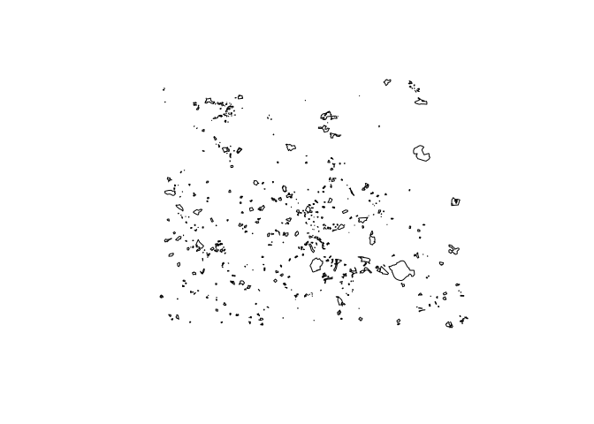<!-- -->

## 2.3 Loading data for this session

To download data used in this session go to
<https://github.com/ITSLeeds/scities/releases> and click on
[**data\_sci.zip**](https://github.com/ITSLeeds/scities/releases/download/0.1/data_sci.zip)
(or just click on that link).

Unzip the folder. You should now have a folder called `data_sci` on your
computer. Navigate into it and open `.data_sci.Rproj`. You should now be
in an R session with access to all the data needed for this tutorial.

## 2.4 Loading `.csv` format data

The base installation of R comes with core functions for reading `.txt`,
`csv` and other tabular formats. To load data from local files you need
to point R / RStudio to the directory that contains the local file. One
way is to use the `setwd()` function as in the below

``` r
## Mac
wd_old = setwd("data_sci/")
```

``` r
## Windows
setwd("C:\\users\\...\\data_sci")
```

Another is to use the menu system

**Session \> Set Working Directory …** which give you options to chose
from.

However you do it you should now set your working directory to the
folder that contains the file `msoa_data_in.csv` and run the code below
to load the data:

``` r
# load the data
ttw <- read.csv("msoa_data_in.csv")
```

This loads a data table of 107 rows and 109 columns. These are data for
the 107 MSOAs census areas in Leeds. These are *Medium Super Output
Areas* containing around ~7,500 people in each. Here the data was
obtained from <https://www.nomisweb.co.uk/census/2011/WU03EW> and
describes proportions of people travelling to work by bike ***from***
each MSOA ***to*** each MSOA. Data with from-to information are known as
“origin-destination” data or “flow” data.

. You can inspect the data in a few ways.

``` r
## dimensions - rows and columns
dim(ttw)
#> [1] 107 109
## column / variable names
names(ttw)
#>   [1] "From_MSOA" "Pop"       "E02002330" "E02002331" "E02002332"
#>   [6] "E02002333" "E02002334" "E02002335" "E02002336" "E02002337"
#>  [11] "E02002338" "E02002339" "E02002340" "E02002341" "E02002342"
#>  [16] "E02002343" "E02002344" "E02002345" "E02002346" "E02002347"
#>  [21] "E02002348" "E02002349" "E02002350" "E02002351" "E02002352"
#>  [26] "E02002353" "E02002354" "E02002356" "E02002357" "E02002358"
#>  [31] "E02002359" "E02002360" "E02002361" "E02002362" "E02002363"
#>  [36] "E02002364" "E02002366" "E02002367" "E02002368" "E02002369"
#>  [41] "E02002370" "E02002371" "E02002373" "E02002374" "E02002375"
#>  [46] "E02002376" "E02002377" "E02002379" "E02002380" "E02002381"
#>  [51] "E02002382" "E02002383" "E02002384" "E02002385" "E02002386"
#>  [56] "E02002387" "E02002388" "E02002389" "E02002390" "E02002391"
#>  [61] "E02002392" "E02002393" "E02002394" "E02002395" "E02002396"
#>  [66] "E02002397" "E02002398" "E02002399" "E02002400" "E02002401"
#>  [71] "E02002402" "E02002403" "E02002404" "E02002405" "E02002406"
#>  [76] "E02002407" "E02002408" "E02002409" "E02002410" "E02002411"
#>  [81] "E02002412" "E02002414" "E02002415" "E02002416" "E02002417"
#>  [86] "E02002418" "E02002419" "E02002420" "E02002421" "E02002422"
#>  [91] "E02002423" "E02002424" "E02002425" "E02002426" "E02002427"
#>  [96] "E02002428" "E02002429" "E02002430" "E02002431" "E02002432"
#> [101] "E02002433" "E02002434" "E02002435" "E02002436" "E02002437"
#> [106] "E02006852" "E02006861" "E02006875" "E02006876"
## look at the first 6 rows and 7 columns
ttw[1:6,1:7]
#>   From_MSOA  Pop   E02002330   E02002331   E02002332   E02002333
#> 1 E02002330 1665 0.000600601 0.022822823 0.000000000 0.001201201
#> 2 E02002331 1506 0.000000000 0.023904382 0.000000000 0.000000000
#> 3 E02002332 1565 0.000000000 0.000000000 0.003194888 0.005111821
#> 4 E02002333 2346 0.000000000 0.000000000 0.000000000 0.006393862
#> 5 E02002334 1784 0.000000000 0.011210762 0.000000000 0.000000000
#> 6 E02002335 2043 0.000000000 0.004894763 0.000000000 0.000000000
#>     E02002334
#> 1 0.000600601
#> 2 0.000664011
#> 3 0.000000000
#> 4 0.000000000
#> 5 0.006165919
#> 6 0.000000000
## use the sumamry function for the first 7 columns
summary(ttw[,1:7])
#>      From_MSOA        Pop         E02002330           E02002331        
#>  E02002330:  1   Min.   :1421   Min.   :0.000e+00   Min.   :0.0000000  
#>  E02002331:  1   1st Qu.:1830   1st Qu.:0.000e+00   1st Qu.:0.0000000  
#>  E02002332:  1   Median :2146   Median :0.000e+00   Median :0.0000000  
#>  E02002333:  1   Mean   :2209   Mean   :1.047e-05   Mean   :0.0006434  
#>  E02002334:  1   3rd Qu.:2542   3rd Qu.:0.000e+00   3rd Qu.:0.0000000  
#>  E02002335:  1   Max.   :4151   Max.   :6.006e-04   Max.   :0.0239044  
#>  (Other)  :101                                                         
#>    E02002332           E02002333           E02002334        
#>  Min.   :0.000e+00   Min.   :0.0000000   Min.   :0.000e+00  
#>  1st Qu.:0.000e+00   1st Qu.:0.0000000   1st Qu.:0.000e+00  
#>  Median :0.000e+00   Median :0.0000000   Median :0.000e+00  
#>  Mean   :7.022e-05   Mean   :0.0001971   Mean   :7.902e-05  
#>  3rd Qu.:0.000e+00   3rd Qu.:0.0000000   3rd Qu.:0.000e+00  
#>  Max.   :3.195e-03   Max.   :0.0063939   Max.   :6.166e-03  
#> 
```

The default for `read.csv` is that the file has a header (i.e. the first
row contains the names of the columns) and that the separator between
values in any record is a comma. However these can be changed depending
on the nature of the file you are seeking to load into R. A number of
different types of files can be read into R.You should examine the help
files for reading data in different formats. Enter `??read` to see some
of these listed. You will note that `read.table` and `write.table`
require more parameters to be specified than `read.csv` and `write.csv`.

## 2.5 Loading spatial data including Shapefiles and Rasters

The code below loads an ESRI format spatial data shapefile using the
`st_read` function in the `sf` package, which you should have installed
and loaded earlier. The `st_read` function can be used to load some
spatial data:

``` r
# load Spatial data  
msoa <- st_read("MSOA_BoundaryData/england_msoa_ru_classn_2011.dbf")  
#> Reading layer `england_msoa_ru_classn_2011' from data source `/mnt/27bfad9a-3474-4e61-9a43-0156ebc67d67/home/robin/ITSLeeds/scities/MSOA_BoundaryData/england_msoa_ru_classn_2011.dbf' using driver `ESRI Shapefile'
#> Simple feature collection with 107 features and 5 fields
#> geometry type:  POLYGON
#> dimension:      XY
#> bbox:           xmin: 413220.1 ymin: 422595.3 xmax: 446879 ymax: 450175.3
#> epsg (SRID):    NA
#> proj4string:    +proj=tmerc +lat_0=49 +lon_0=-2 +k=0.9996012717 +x_0=400000 +y_0=-100000 +datum=OSGB36 +units=m +no_defs
```

This data was obtained from the UK Census Data service. It simply
contains outlines of the MSOA areas. The data attributes can be examined
using the `as_tibble` function from the `tidyverse`:

``` r
head(as_tibble(msoa))
#> # A tibble: 6 x 6
#>   ruc11     ruc11cd label    name   code                          geometry
#>   <fct>     <fct>   <fct>    <fct>  <fct>                    <POLYGON [m]>
#> 1 Urban ci… C1      E080000… Leeds… E020… ((440369.2 449848, 440386.5 449…
#> 2 Urban ci… C1      E080000… Leeds… E020… ((443381.7 450063.5, 443376 450…
#> 3 Urban ma… A1      E080000… Leeds… E020… ((419488.2 446933.7, 419494 446…
#> 4 Urban ma… A1      E080000… Leeds… E020… ((422941.2 446149.6, 422943 446…
#> 5 Rural to… D1      E080000… Leeds… E020… ((442102 446256, 442102 446216,…
#> 6 Rural vi… E1      E080000… Leeds… E020… ((438056.3 448191.8, 438105.3 4…
```

You can also examine the spatial properties of the data using the `plot`
function associated with `sf` objects. This can be used to plot the
outline of the data objects.

``` r
# outline
plot(st_geometry(msoa))
```

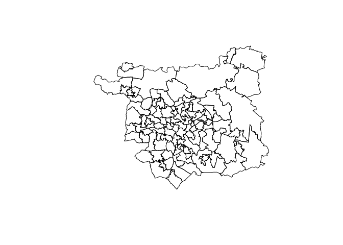<!-- -->

You can also load some raster data: The code below gives an example but
I am not sure whether to keep this
in\!

``` r
setwd( "/Users/geoaco/Desktop/my_docs_mac/leeds_work/research/COSIT/paperanal/new_anal_v3/")
new.proj <- CRS("+proj=tmerc +lat_0=49 +lon_0=-2 +k=0.999601272 +x_0=400000 +y_0=-100000
+ +ellps=airy +towgs84=375,-111,431,0,0,0,0 +units=m +no_defs")
y  <- as(readGDAL("2011_all/2011_b1.rst"), "RasterLayer"); proj4string(y)  <- new.proj
x1 <- as(readGDAL("2011_all/2011_b2.rst"), "RasterLayer"); proj4string(x1) <- new.proj
x2 <- as(readGDAL("2011_all/2011_b3.rst"), "RasterLayer"); proj4string(x2) <- new.proj
x3 <- as(readGDAL("2011_all/2011_b4.rst"), "RasterLayer"); proj4string(x3) <- new.proj
r <- stack(y,x1,x2,x3)
ex <- extent(604000, 619000, 290000, 305000)
rc <- crop(r, ex) 
names(rc) <- c("y", "x1", "x2","x3")
save(rc, file = "rc.RData")
```

``` r
load("rc.RData")
png(filename = "rc.png", w = 8, h = 8, units = "in", res = 600)
plotRGB(stack(rc), 3,2,1, stretch="lin")
scalebar(5000, type = "bar", xy = c(613246.3, 290702.6), divs = 4, col = "white", below = "m")
dev.off()
df.rc <- data.frame(getValues(rc))
```

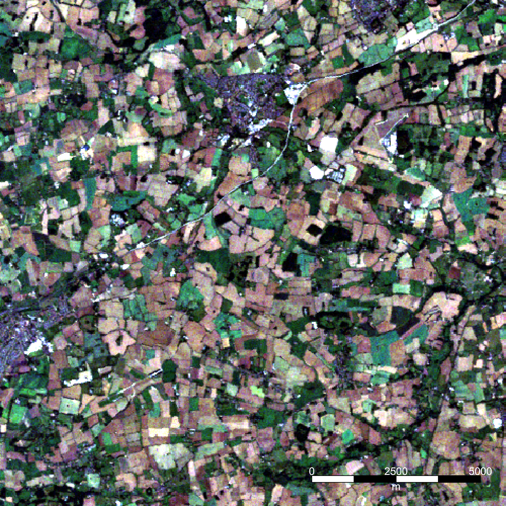<!-- -->

## 2.6 Loading R binary files

You can also load R binary files. These have the advantage of being very
efficient at storing data and quicker to load than for example, `.csv`
files. By convention they have a `.rda` or `.RData` extension:

``` r
load("ttw.rda")
## use ls to see what is loaded
ls()
```

You should see that a variable called `bike_travel` has been loaded. It
is the same as the data read into `ttw`. You can explore the
`bike_travel` R object if you want to using the functions above that
were applied to `ttw`.

## 2.7 Other data formats

If you continue to work with R you will want to use all kinds of
different data formats - from different flavours of data table `.CSV`,
`Excel`, `SPSS` to explicitly geographical data such as shapefiles and
rasters. These can all be loaded directly into R using functions from
different packages. There are too many to cover comprehensively. But
generally if there is a data format out there, there is also a tool to
get it into R\!

The `foreign` package can be used to load many file types (e.g. EXCEL
and SPSS) and a number of different approaches for reading data types
are listed here: <https://www.r-bloggers.com/read-excel-files-from-r/>

# 3\. Data export

## 3.1 CSV Files

Data can be written into a Comma Separated Variable file using the
command `write.csv` and then read back into a different variable, as
follows:

``` r
write.csv(ttw, file = "ttw.csv")
```

This writes a `.csv` file into the current working directory. If you
open it using a text editor or a spreadsheet software, you will see that
it has the expected column plus the index for each record. This is
because the default for `write.csv` includes the `row.names = TRUE`
parameter. Again examine the help file for this function.

``` r
write.csv(ttw, file = "test.csv", row.names = F)
```

## 3.2 Spatial data including Shapefiles

In a similar way the `st_write` function can used to write data out into
a number of formats

``` r
st_write(msoa, "msoa.shp" )
```

## 3.3 R Data files

It is possible to save variables that are in your workspace to a
designated `.rda` or `.RData` file. This can be loaded at the start of
your next session. Saving your *workspace* saves everything that is
present in your workspace - as listed by `ls()` - whilst the `save`
command allows you to specify what variables you wish to save.

There are a number of ways to do this:

You can save the workspace using the drop down menus **Session \> Save
Workspace As…**

You can save the workspace using the `save.image` function

``` r
save.image(file = "myworkspace.RData")
```

You can save specified elements using the `save` function recalling that
either `.rda` or `.RData` extensions can be used:

``` r
# this will save everything in the workspace
save(list = ls(), file = "MyData.rda")
# this will save just ttw
save(list = "ttw", file = "MyData.RData")
# this will save ttw and msoa
save(list = c("ttw", "msoa"), file = "AllData.rda")
```

Make sure you run the last line of code as you will use the results in
the next section.

# 4\. Initial Exploratory Data Analysis

The aim of Exploratory Data Analysis (EDA) is to examine the data.
Specifically you might might be interested in distributions, mean,
median, max and min values, tables of class counts and, if undertaking
some kind of statistical analysis such as regression, examining the
correlations between the covariates and the target variable, determining
the presence of any collinearity. The aim here is understanding - what
do the data show, what are the spatial and non-spatial properties, what
variables might you include or exclude from your analysis (variable
selection).

In the below these considerations are evaluated in the following
sequence:

1.  simple descriptive statistics
2.  Distributions and skewness (you may need to undertake
    transformations of certain variables) and the presence of outliers.
3.  Correlations (but these are not covered in this workshop)

In the previous sections you loaded and saved a number of R objects. To
make sure you have the right data you should clear your workspace and
re-load the `AllData.rda` file. To clear our workspace either go to
**Session \> Clear Workspace…**\* or enter

``` r
rm(list = ls())
```

Load the travel to work data by cycling again for the MSOAs in Leeds and
check what is loaded us `ls()`:

``` r
load("AllData.rda")
ls()
#> [1] "msoa" "ttw"
```

## 4.1 Simple data explorations

You have two R objects in your workspace: `ttw` `and`msoa\`. The first
thing is establish what types or classes they are:

    class(ttw)
    class(msoa)

Here we can see that both objects are of the class `data.frame`. This is
a data table a but like a spreadsheet in Excel. The `msoa` object is
also of class `sf` indicating its spatial nature.

First, examine the `ttw` data. This records the proportions of working
people (commuters) cycling to work in each MSOA area to each other MSOA
area in Leeds (the data is *WU03EW - Location of usual residence and
place of work by method of travel to work (MSOA level* and has been
downloaded from here: <https://www.nomisweb.co.uk/census/2011/WU03EW>
and manipulated a bit for use in this workshop). The MSOA codes in the
`ttw` data contains the **origin** (rows) and **desination** (columns)
MSOAs. The `dim`, `head` and `names` functions show that the data has
107 rows, 109 columns, the names are a series of census codes:

``` r
dim(ttw)
#> [1] 107 109
names(ttw)
#>   [1] "From_MSOA" "Pop"       "E02002330" "E02002331" "E02002332"
#>   [6] "E02002333" "E02002334" "E02002335" "E02002336" "E02002337"
#>  [11] "E02002338" "E02002339" "E02002340" "E02002341" "E02002342"
#>  [16] "E02002343" "E02002344" "E02002345" "E02002346" "E02002347"
#>  [21] "E02002348" "E02002349" "E02002350" "E02002351" "E02002352"
#>  [26] "E02002353" "E02002354" "E02002356" "E02002357" "E02002358"
#>  [31] "E02002359" "E02002360" "E02002361" "E02002362" "E02002363"
#>  [36] "E02002364" "E02002366" "E02002367" "E02002368" "E02002369"
#>  [41] "E02002370" "E02002371" "E02002373" "E02002374" "E02002375"
#>  [46] "E02002376" "E02002377" "E02002379" "E02002380" "E02002381"
#>  [51] "E02002382" "E02002383" "E02002384" "E02002385" "E02002386"
#>  [56] "E02002387" "E02002388" "E02002389" "E02002390" "E02002391"
#>  [61] "E02002392" "E02002393" "E02002394" "E02002395" "E02002396"
#>  [66] "E02002397" "E02002398" "E02002399" "E02002400" "E02002401"
#>  [71] "E02002402" "E02002403" "E02002404" "E02002405" "E02002406"
#>  [76] "E02002407" "E02002408" "E02002409" "E02002410" "E02002411"
#>  [81] "E02002412" "E02002414" "E02002415" "E02002416" "E02002417"
#>  [86] "E02002418" "E02002419" "E02002420" "E02002421" "E02002422"
#>  [91] "E02002423" "E02002424" "E02002425" "E02002426" "E02002427"
#>  [96] "E02002428" "E02002429" "E02002430" "E02002431" "E02002432"
#> [101] "E02002433" "E02002434" "E02002435" "E02002436" "E02002437"
#> [106] "E02006852" "E02006861" "E02006875" "E02006876"
ttw[1:6, 1:10]
#>   From_MSOA  Pop   E02002330   E02002331   E02002332   E02002333
#> 1 E02002330 1665 0.000600601 0.022822823 0.000000000 0.001201201
#> 2 E02002331 1506 0.000000000 0.023904382 0.000000000 0.000000000
#> 3 E02002332 1565 0.000000000 0.000000000 0.003194888 0.005111821
#> 4 E02002333 2346 0.000000000 0.000000000 0.000000000 0.006393862
#> 5 E02002334 1784 0.000000000 0.011210762 0.000000000 0.000000000
#> 6 E02002335 2043 0.000000000 0.004894763 0.000000000 0.000000000
#>     E02002334   E02002335   E02002336   E02002337
#> 1 0.000600601 0.000000000 0.000000000 0.000000000
#> 2 0.000664011 0.000664011 0.000000000 0.000000000
#> 3 0.000000000 0.000000000 0.001277955 0.000638978
#> 4 0.000000000 0.000000000 0.001705030 0.000852515
#> 5 0.006165919 0.000000000 0.000000000 0.000000000
#> 6 0.000000000 0.000978953 0.000000000 0.000000000
```

There are 107 of these areas in Leeds. Notice how the code above just
examined the first 10 columns of the `ttw` data and notice how low the
data values are. This s confirmed when the `summary` function is used:

``` r
summary(ttw[, 3:10])
#>    E02002330           E02002331           E02002332        
#>  Min.   :0.000e+00   Min.   :0.0000000   Min.   :0.000e+00  
#>  1st Qu.:0.000e+00   1st Qu.:0.0000000   1st Qu.:0.000e+00  
#>  Median :0.000e+00   Median :0.0000000   Median :0.000e+00  
#>  Mean   :1.047e-05   Mean   :0.0006434   Mean   :7.022e-05  
#>  3rd Qu.:0.000e+00   3rd Qu.:0.0000000   3rd Qu.:0.000e+00  
#>  Max.   :6.006e-04   Max.   :0.0239044   Max.   :3.195e-03  
#>    E02002333           E02002334           E02002335        
#>  Min.   :0.0000000   Min.   :0.000e+00   Min.   :0.000e+00  
#>  1st Qu.:0.0000000   1st Qu.:0.000e+00   1st Qu.:0.000e+00  
#>  Median :0.0000000   Median :0.000e+00   Median :0.000e+00  
#>  Mean   :0.0001971   Mean   :7.902e-05   Mean   :6.957e-05  
#>  3rd Qu.:0.0000000   3rd Qu.:0.000e+00   3rd Qu.:0.000e+00  
#>  Max.   :0.0063939   Max.   :6.166e-03   Max.   :1.122e-03  
#>    E02002336          E02002337        
#>  Min.   :0.000000   Min.   :0.000e+00  
#>  1st Qu.:0.000000   1st Qu.:0.000e+00  
#>  Median :0.000000   Median :0.000e+00  
#>  Mean   :0.000171   Mean   :4.227e-05  
#>  3rd Qu.:0.000000   3rd Qu.:0.000e+00  
#>  Max.   :0.002474   Max.   :1.104e-03
# examine the Pop variable
summary(ttw$Pop)
#>    Min. 1st Qu.  Median    Mean 3rd Qu.    Max. 
#>    1421    1830    2146    2209    2542    4151
```

We can see the total proportions of the commuting population that is
cycling to work living in each LSOA using the code below.

``` r
round(apply(ttw[, 3:109], 1, sum), 2)
#>   [1] 0.03 0.03 0.02 0.02 0.02 0.01 0.02 0.01 0.02 0.02 0.03 0.01 0.02 0.01
#>  [15] 0.01 0.03 0.01 0.01 0.02 0.03 0.02 0.01 0.03 0.04 0.02 0.03 0.03 0.01
#>  [29] 0.01 0.04 0.04 0.04 0.05 0.02 0.03 0.03 0.02 0.02 0.02 0.03 0.06 0.05
#>  [43] 0.02 0.02 0.02 0.02 0.02 0.02 0.01 0.05 0.02 0.05 0.02 0.03 0.03 0.02
#>  [57] 0.01 0.02 0.03 0.02 0.03 0.01 0.03 0.02 0.02 0.02 0.03 0.02 0.01 0.02
#>  [71] 0.02 0.01 0.01 0.02 0.02 0.02 0.02 0.03 0.02 0.03 0.02 0.01 0.01 0.01
#>  [85] 0.02 0.02 0.02 0.02 0.02 0.01 0.01 0.02 0.02 0.02 0.01 0.01 0.01 0.01
#>  [99] 0.02 0.01 0.01 0.01 0.01 0.06 0.06 0.02 0.02
```

The numbers are low - typically around 0.02. We could make the numbers a
bit easier to interpret by normalising these proportions so that they
describe the numbers of commuters by bike per 1000 commuters

``` r
ttw[, 3:109] <- ttw[,2] * ttw[, -c(1,2)]
ttw[1:6, 1:10]
#>   From_MSOA  Pop E02002330 E02002331 E02002332 E02002333 E02002334
#> 1 E02002330 1665  1.000001        38         0         2  1.000001
#> 2 E02002331 1506  0.000000        36         0         0  1.000001
#> 3 E02002332 1565  0.000000         0         5         8  0.000000
#> 4 E02002333 2346  0.000000         0         0        15  0.000000
#> 5 E02002334 1784  0.000000        20         0         0 10.999999
#> 6 E02002335 2043  0.000000        10         0         0  0.000000
#>   E02002335 E02002336 E02002337
#> 1  0.000000         0  0.000000
#> 2  1.000001         0  0.000000
#> 3  0.000000         2  1.000001
#> 4  0.000000         4  2.000000
#> 5  0.000000         0  0.000000
#> 6  2.000001         0  0.000000
```

And then when we look at the numbers cycling from each LSOA origin again

``` r
round(apply(ttw[, 3:109], 1, sum), 2)
#>   [1]  46  43  26  57  38  28  29  19  38  34  47  27  30  28  36  43  22
#>  [18]  26  30  59  37  17  83  92  49  68  80  28  24 105  68  98 141  30
#>  [35]  59  59  60  43  42  86 161 123  41  35  36  27  37  36  17  91  40
#>  [52] 141  45  55  79  32  31  63  55  38  54  19  91  42  49  51  63  37
#>  [69]  27  31  63  30  32  34  38  30  48  73  40  51  31  24  15  20  48
#>  [86]  68  38  36  40  35  31  41  35  36  34  23  41  26  48  34  25  19
#> [103]  17 258 184  54  67
```

There are obviously some areas that which have more cycling commuters
(let’s call them *CCs*) than others.

-----

**NB** the line of code above although complex, can be unpicked: -
`apply` is a function that applies another function to a data table
either over each row in the data table or each column. The direction the
function is applied is indicated by the second argument in the call to
the function, in this case `1` for each row (`2` would indicate each
column) - the function is `sum` which sums all the values in each row -
the data table, `ttw[, 3:109]` is all rows and columns 3 to 109 -
`round` is another function that allows you to control the number of
decimal places, in this case 2 (although none were shown: try running
`apply(ttw[, 3:109], 1, sum` to see what happens when you don’t use it)

So just by change the `1` to `2` the same code can be used to see how
many people travel *to* each MSOA ie each destination (The `as.vector`
gets rid of the names in the result):

``` r
as.vector(round(apply(ttw[, 3:109], 2, sum), 2))
#>   [1]    2  116   13   43   15   16   37    9   13   22   11   13    2   13
#>  [15]    7   15    9   27   33   17   26    3   49    7   14   61   25   47
#>  [29]    8    7   21   10   49   31   15   15   12    6    4   28   49   27
#>  [43]    8    5   19   11    3   18   14    5  127   66   66   19    5    8
#>  [57]   38   59  546  169   37   34   41    3   15  125  154   11   30   25
#>  [71]   88   10   13   17   17   15   59  141   49   57   21   34    7    3
#>  [85]   86   77    6   49    2   26    5   12   14    4    8    6   29   10
#>  [99]   25    7   52   12    1   87   59 1381  292
```

There are some MSOAs that have very high numbers of people cycling to
them. Why do you think this is? \*\*\*\*

## 4.2 Visual data expolorations

The `hist` function can be used visually sumamrise distributions of
values across the MSOAS. Try running the code below;

``` r
hist(ttw$Pop, breaks = 10,
  xlab = "Population", main = "Populations across MSOAs in Leeds", col = "red")
```

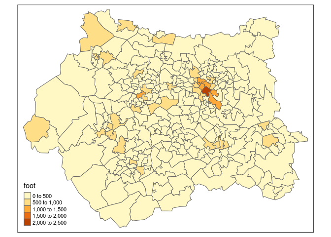<!-- -->

Alternatively`ggplot2` package that is loaded with the `tidyverse` van
also be used:

``` r
ggplot(ttw, aes(x=Pop)) + 
    geom_histogram(binwidth=180,colour="white", fill = "red") +
    xlab("Population")+
    labs(title="Populations across MSOAs in Leeds")
```

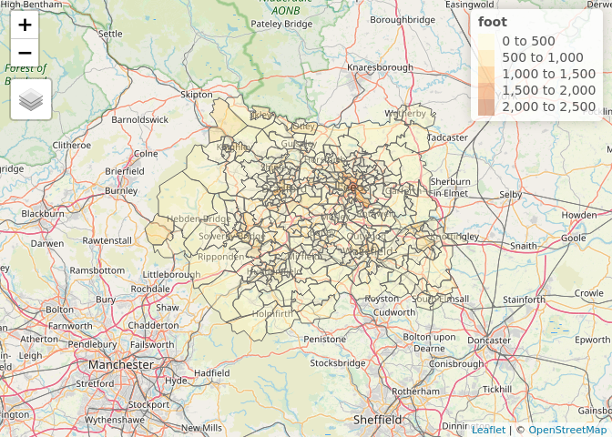<!-- -->

This is more involved than simple `hist` but the basic idea is that
`ggplot` is called and then the type of plot is specified. It allows
layers of plot instructions to be compiled. It can also be used to
create density plots:

``` r
ggplot(ttw, aes(x=Pop)) + 
    geom_histogram(aes(y=..density..),
                   binwidth=180,colour="white") +
    geom_density(alpha=.2, fill="#FF6666") +
    theme(axis.title.y=element_blank())+
    xlab("Population")+
    labs(title="Populations across MSOAs in Leeds")
```

<!-- -->

The `boxplot()` function also provides a useful way of summarising data:

``` r
boxplot(ttw$Pop, main = "The distribution MSOA populations in Leeds")
```

<!-- -->

And there is `ggplot` version as well but this is not so good for single
values and better when comparing distributions of some value across
categorical variables (as is done later in this section)

``` r
ggplot(ttw, aes(x=1, y = Pop)) + 
    geom_boxplot() 
```

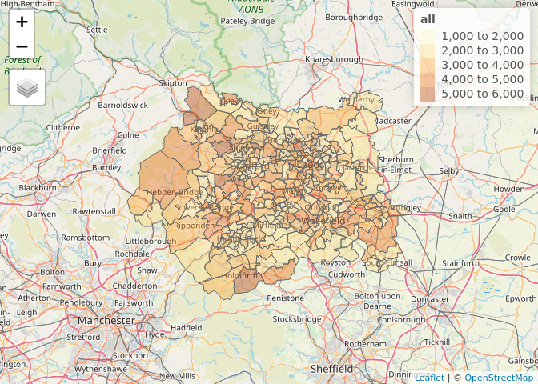<!-- -->

We can also examine the `msoa` object in the same way. The `as_tibble`
function converts the `data.frame` of `msoa` to a `tibble format. We do
not have time to cover this here but these are another data table
similar to`data.frame\` but a bit smarter

``` r
summary(as_tibble(msoa))
#>                          ruc11    ruc11cd                label    
#>  Rural town and fringe      : 5   A1:94   E08000035E02002330:  1  
#>  Rural village and dispersed: 2   C1: 6   E08000035E02002331:  1  
#>  Urban city and town        : 6   D1: 5   E08000035E02002332:  1  
#>  Urban major conurbation    :94   E1: 2   E08000035E02002333:  1  
#>                                           E08000035E02002334:  1  
#>                                           E08000035E02002335:  1  
#>                                           (Other)           :101  
#>         name            code              geometry  
#>  Leeds 001:  1   E02002330:  1   POLYGON      :107  
#>  Leeds 002:  1   E02002331:  1   epsg:NA      :  0  
#>  Leeds 003:  1   E02002332:  1   +proj=tmer...:  0  
#>  Leeds 004:  1   E02002333:  1                      
#>  Leeds 005:  1   E02002334:  1                      
#>  Leeds 006:  1   E02002335:  1                      
#>  (Other)  :101   (Other)  :101
```

This shows that we have some categorical variables (actual a Rural and
Urban classification) and some codes relating to MSOA labeling.

As this is spatial data some of these attributes can be mapped: Or the
attributes held by each object in the spatial dataset (in this case 107
MSOA census areas in Leeds:

``` r
# plot by attrubute
plot(msoa["ruc11cd"])
```

<!-- -->

The `tmap` package allows more sophisticated maps (as `ggplot2` does for
other graphics):

``` r
tm_shape(msoa) +
  tm_polygons("ruc11cd")
```

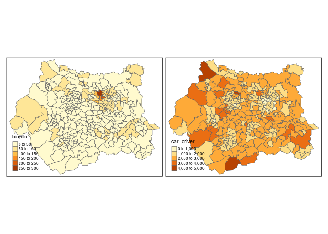<!-- -->

However, `tmap` also allows interactive graphics for example with an
OpenStreetMap backdrop, Notice the use of transparency parameter
specified through `aslpha` and a particular OSM backdrop in the code
below:

``` r
# set the mode to view for OSM
tmap_mode('view')
#> tmap mode set to interactive viewing
# call the basic map but with 
tm_shape(msoa) +
  tm_polygons("ruc11cd", alph = 0.4) +
  tm_view(basemaps = "OpenStreetMap")
```

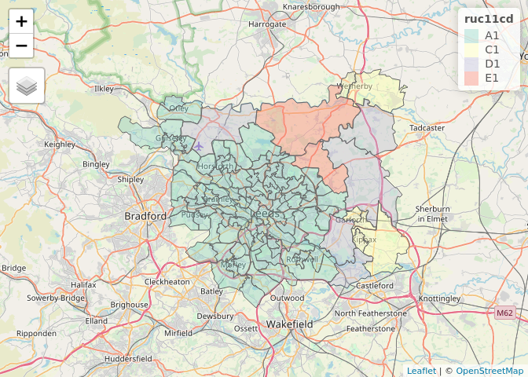<!-- -->

``` r
# reset the plot mode
tmap_mode('plot')
#> tmap mode set to plotting
```

You should be able to zoom in and explore *where* these different
classes of urban and ruralness are.

## 4.3 Combining / Joining data

You may have noticed that `ttw` and `msoa` have an attribute in common:

``` r
head(ttw$From_LSOA)
#> NULL
head(msoa$code)
#> [1] E02002330 E02002331 E02002332 E02002333 E02002334 E02002335
#> 107 Levels: E02002330 E02002331 E02002332 E02002333 E02002334 ... E02006876
```

These can be used to link or join the data together.

``` r
temp <- full_join(msoa, ttw, by = c("code" = "From_MSOA"))
class(temp)
#> [1] "sf"         "data.frame"
names(temp)
#>   [1] "ruc11"     "ruc11cd"   "label"     "name"      "code"     
#>   [6] "Pop"       "E02002330" "E02002331" "E02002332" "E02002333"
#>  [11] "E02002334" "E02002335" "E02002336" "E02002337" "E02002338"
#>  [16] "E02002339" "E02002340" "E02002341" "E02002342" "E02002343"
#>  [21] "E02002344" "E02002345" "E02002346" "E02002347" "E02002348"
#>  [26] "E02002349" "E02002350" "E02002351" "E02002352" "E02002353"
#>  [31] "E02002354" "E02002356" "E02002357" "E02002358" "E02002359"
#>  [36] "E02002360" "E02002361" "E02002362" "E02002363" "E02002364"
#>  [41] "E02002366" "E02002367" "E02002368" "E02002369" "E02002370"
#>  [46] "E02002371" "E02002373" "E02002374" "E02002375" "E02002376"
#>  [51] "E02002377" "E02002379" "E02002380" "E02002381" "E02002382"
#>  [56] "E02002383" "E02002384" "E02002385" "E02002386" "E02002387"
#>  [61] "E02002388" "E02002389" "E02002390" "E02002391" "E02002392"
#>  [66] "E02002393" "E02002394" "E02002395" "E02002396" "E02002397"
#>  [71] "E02002398" "E02002399" "E02002400" "E02002401" "E02002402"
#>  [76] "E02002403" "E02002404" "E02002405" "E02002406" "E02002407"
#>  [81] "E02002408" "E02002409" "E02002410" "E02002411" "E02002412"
#>  [86] "E02002414" "E02002415" "E02002416" "E02002417" "E02002418"
#>  [91] "E02002419" "E02002420" "E02002421" "E02002422" "E02002423"
#>  [96] "E02002424" "E02002425" "E02002426" "E02002427" "E02002428"
#> [101] "E02002429" "E02002430" "E02002431" "E02002432" "E02002433"
#> [106] "E02002434" "E02002435" "E02002436" "E02002437" "E02006852"
#> [111] "E02006861" "E02006875" "E02006876" "geometry"
head(as_tibble(temp[, 1:6]))
#> # A tibble: 6 x 7
#>   ruc11    ruc11cd label   name  code    Pop                      geometry
#>   <fct>    <fct>   <fct>   <fct> <fct> <int>                 <POLYGON [m]>
#> 1 Urban c… C1      E08000… Leed… E020…  1665 ((440369.2 449848, 440386.5 …
#> 2 Urban c… C1      E08000… Leed… E020…  1506 ((443381.7 450063.5, 443376 …
#> 3 Urban m… A1      E08000… Leed… E020…  1565 ((419488.2 446933.7, 419494 …
#> 4 Urban m… A1      E08000… Leed… E020…  2346 ((422941.2 446149.6, 422943 …
#> 5 Rural t… D1      E08000… Leed… E020…  1784 ((442102 446256, 442102 4462…
#> 6 Rural v… E1      E08000… Leed… E020…  2043 ((438056.3 448191.8, 438105.…
```

Notice how the attributes from `ttw` have been joined to those of `msoa`
in `temp` which is also a `sf` object. It can be mapped as before, again
with a transparency term:

``` r
tmap_mode('view')
#> tmap mode set to interactive viewing
tm_shape(temp) +
  tm_polygons("Pop", alph = 0.4) +
  tm_view(basemaps = "OpenStreetMap")
```

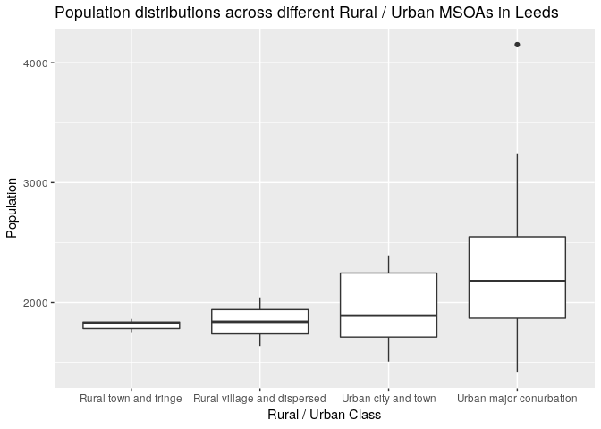<!-- -->

``` r
# reset the plot mode
tmap_mode('plot')
#> tmap mode set to plotting
```

And a boxplot of the population distributions for different types of
MSOA can be shown together:

``` r
# Boxplot
ggplot(temp, aes(ruc11, Pop)) +
  geom_boxplot()+
  xlab("Rural / Urban Class")+
  ylab("Population")+
  labs(title="Population distributions across different Rural / Urban MSOAs in Leeds")
```

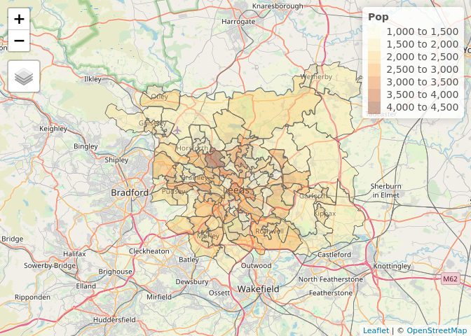<!-- -->

Further resources on **ggplot2** can be found here:

  - ggplot guide:
    <http://www.sthda.com/english/wiki/be-awesome-in-ggplot2-a-practical-guide-to-be-highly-effective-r-software-and-data-visualization>
  - ggplot cheat sheet:
    <https://www.rstudio.com/wp-content/uploads/2015/03/ggplot2-cheatsheet.pdf>

# 5\. Summary of work so far

This session has provided some rubrics for working in R (scripts, etc)
showed how to get data in and out of R and developed some simple
visualisations of data.

In later sessions we will expand n this but using the `ggplot2` package.
This comes with the `tidyverse` and although it involves a bit of a
learning curve it produces excellent visualisations and is extremely
controllable. However there is at first but there is plenty of help and
advice on the internet and in core text books. For example the following
sites may be useful:

You should be set up for the rest of the workshop and

  - have R and RStudio installed
  - be able to create and save scripts for your code
  - annotate the code with comments using the `#` symbol
  - set and change your working directory (either through the menu or
    use `setwd()`)
  - be able to load csv spatial and R data files from local folders

If **any** of the above are not true then please talk to Lex or Robin
now\!\!\!

Next we will develop some analysis of flows.

# 6\. Flows

## 6.1 Origins and Destinations

In the second part of the practical we will look at commuting flows
between MSOAs by bike and identify opportunities for extending the cycle
network in Leeds

Recall that the `temp` variable combines the spatial data and the
cycling data. The rows are are each origin and the LSOA coded columns
are the destinations with other variables:

``` r
as_tibble(temp[1:4])
#> # A tibble: 107 x 5
#>    ruc11       ruc11cd label     name                             geometry
#>    <fct>       <fct>   <fct>     <fct>                       <POLYGON [m]>
#>  1 Urban city… C1      E0800003… Leed… ((440369.2 449848, 440386.5 449822…
#>  2 Urban city… C1      E0800003… Leed… ((443381.7 450063.5, 443376 450051…
#>  3 Urban majo… A1      E0800003… Leed… ((419488.2 446933.7, 419494 446933…
#>  4 Urban majo… A1      E0800003… Leed… ((422941.2 446149.6, 422943 446135…
#>  5 Rural town… D1      E0800003… Leed… ((442102 446256, 442102 446216, 44…
#>  6 Rural vill… E1      E0800003… Leed… ((438056.3 448191.8, 438105.3 4481…
#>  7 Rural town… D1      E0800003… Leed… ((428851.2 445382.2, 428861.3 4453…
#>  8 Urban majo… A1      E0800003… Leed… ((414959.3 443688.3, 414987 443671…
#>  9 Urban majo… A1      E0800003… Leed… ((418635 442559, 418637.6 442552.9…
#> 10 Urban majo… A1      E0800003… Leed… ((420442.4 442436.7, 420443.3 4424…
#> # ... with 97 more rows
```

It is interesting to examine the Origin and Destinations locations from
which and to which cyclists are commuting. To this, we can create 2
variables based on the sum of all cyclists leaving from all origin
locations and the sum of all cyclists arriving at ALL destination
locations.

This could be a bit convoluted using the temp object as would need to
create a copy of temp without geometry and check that the order of the
columns (destinations) matches the order of the rows (origins) in `ttw`
and `temp`, etc etc. Probably the easiest way is to create the variables
in `ttw` and then redo the join above to recreate `temp`. However we
still need to check that order of the Origins (rows) matches that of the
Destinations (columns) in `ttw`. The code below aligns these using the
`match` function.

``` r
index <- match(names(ttw)[3:109], ttw$From_MSOA)
# examine index
index
#>   [1]   1   2   3   4   5   6   7   8   9  10  11  12  13  14  15  16  17
#>  [18]  18  19  20  21  22  23  24  25  26  27  28  29  30  31  32  33  34
#>  [35]  35  36  37  38  39  40  41  42  43  44  45  46  47  48  49  50  51
#>  [52]  52  53  54  55  56  57  58  59  60  61  62  63  64  65  66  67  68
#>  [69]  69  70  71  72  73  74  75  76  77  78  79  80  81  82  83  84  85
#>  [86]  86  87  88  89  90  91  92  93  94  95  96  97  98  99 100 101 102
#> [103] 103 104 105 106 107
# then use it to reorder the rows 
# ie the second element in the match call
ttw <- ttw[index,]
```

Then, now we are confident that the row and column ordering are the same
for the MSOAs, we can calculate the origin and destination totals

``` r
ttw$OriginSum <- round(rowSums(ttw[3:109]),0)
ttw$DestSum <- round(colSums(ttw[3:109]),0)
```

If you examine these then it is evident that the origin values are more
evenly distributed than the destination values:

``` r
ttw$OriginSum
#>   [1]  46  43  26  57  38  28  29  19  38  34  47  27  30  28  36  43  22
#>  [18]  26  30  59  37  17  83  92  49  68  80  28  24 105  68  98 141  30
#>  [35]  59  59  60  43  42  86 161 123  41  35  36  27  37  36  17  91  40
#>  [52] 141  45  55  79  32  31  63  55  38  54  19  91  42  49  51  63  37
#>  [69]  27  31  63  30  32  34  38  30  48  73  40  51  31  24  15  20  48
#>  [86]  68  38  36  40  35  31  41  35  36  34  23  41  26  48  34  25  19
#> [103]  17 258 184  54  67
ttw$DestSum
#>   [1]    2  116   13   43   15   16   37    9   13   22   11   13    2   13
#>  [15]    7   15    9   27   33   17   26    3   49    7   14   61   25   47
#>  [29]    8    7   21   10   49   31   15   15   12    6    4   28   49   27
#>  [43]    8    5   19   11    3   18   14    5  127   66   66   19    5    8
#>  [57]   38   59  546  169   37   34   41    3   15  125  154   11   30   25
#>  [71]   88   10   13   17   17   15   59  141   49   57   21   34    7    3
#>  [85]   86   77    6   49    2   26    5   12   14    4    8    6   29   10
#>  [99]   25    7   52   12    1   87   59 1381  292
```

Now `temp` can be recreated and this time will include these new
attributes:

``` r
temp <- full_join(msoa, ttw, by = c("code" = "From_MSOA"))
```

and the origins and destination values of people commuting by bike can
be mapped.

``` r
tm_shape(temp) +
  tm_polygons(c("OriginSum", "DestSum")) +
  tm_layout(legend.position = c("left","bottom"))
```

<!-- -->

Here we can see that there are very distinct and perhaps expected
patterns with flows into the centre of Leeds from the surrounding areas.

## 6.2 Mapping Flows

In terms of mapping these flows, this can be done using the code below,
adapted from <http://spatial.ly/2015/03/mapping-flows/>. The code
*melts* the `ttw` data to 3 columns, links that to MSOA polygon
geometric centroids (these are points that represent the centre of each
MSOA area) and then merges these together

``` r
# melt the data
input <- melt(ttw[,-c(2, 110, 111)], id.vars = "From_MSOA")
names(input)<- c("origin", "destination","total")
# create centroids with a Code reference
centroids <- data.frame(st_coordinates(st_centroid(msoa)), Code = msoa$code)
#> Warning in st_centroid.sf(msoa): st_centroid assumes attributes are
#> constant over geometries of x
# merge to get the xy coordinates joined to the origins
or.xy<- merge(input, centroids, by.x="origin", by.y="Code")
names(or.xy)<- c("origin", "destination", "trips", "oX", "oY")
# merge to get the xy coordinates joined to the destinations
dest.xy<-  merge(or.xy, centroids, by.x="destination", by.y="Code")
names(dest.xy)<- c("origin", "destination", "trips", "oX", "oY", "dX", "dY")
```

This having been done the flows greater than 3, can be plotted using
`ggplot`. First some parameters need to be set:

``` r
xquiet<- scale_x_continuous("", breaks=NULL)
yquiet<-scale_y_continuous("", breaks=NULL)
quiet<-list(xquiet, yquiet)
```

Then apply `ggplot` with `geom_segment`:

``` r
# plot line segments with ggplot 
ggplot(dest.xy[which(dest.xy$trips>3),])+
  # "alpha=" is line transparency below 
  geom_segment(aes(x=oX, y=oY,xend=dX, yend=dY, alpha=trips), size = 1, col="white")+
  # then set the line transparency - essential to make the plot readable
  scale_alpha_continuous(range = c(0.03, 0.3))+
  # set background, and remove axes and fix aspect ratio
  theme(panel.background = element_rect(fill='black',colour='black'))+
  quiet+
  coord_equal()
```

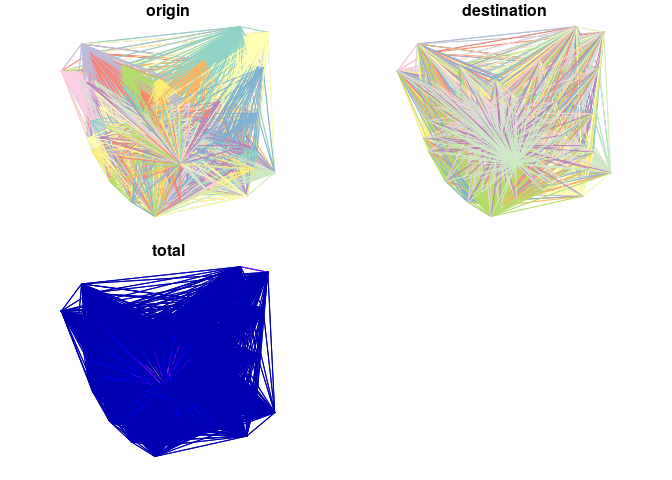<!-- -->

Some context can be applied by modifying the plot commands above:

``` r
# prepare an outline of the study area 
pols <- SpatialPolygonsDataFrame(gUnaryUnion(as(msoa, "Spatial")), data = data.frame(1))
pols@data$id = rownames(pols@data)
pols.points = fortify(pols, region="id")
pols.df = left_join(pols.points, pols@data, by="id")
# then apply a modified version of the above plotting 
ggplot()+
# "alpha=" is line transparency below 
geom_polygon(data = pols.df, aes(x=long, y=lat), colour="grey", fill="tomato") +
geom_segment(data = dest.xy[which(dest.xy$trips>10),], 
  aes(x=oX, y=oY,xend=dX, yend=dY, alpha=trips), size = 1, col="black")+
# then set the line transparency - essential to make the plot readable
  scale_alpha_continuous(range = c(0.03, 0.3))+ coord_equal()
```

<!-- -->

The origin-destination data in `input` can be converted into a spatial
(`sf`) object as follows:

``` r
input_sf = stplanr::od2line(flow = input, msoa["code"])
#> Warning in st_centroid.sf(zones): st_centroid assumes attributes are
#> constant over geometries of x
plot(input_sf)
```

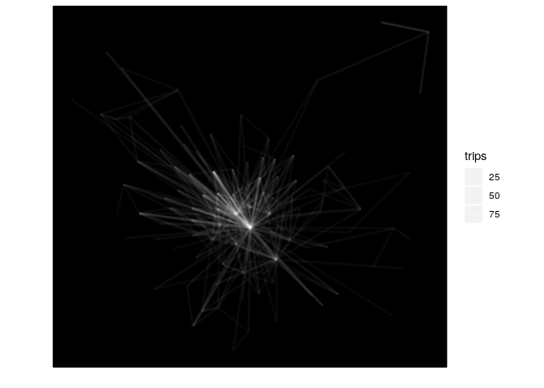<!-- -->

This may look like a [Jackson
Pollok](https://en.wikipedia.org/wiki/Jackson_Pollock) piece of art but
actually the result is useful: `input_sf` is a fully fledged spatial
object so we can do geographic operations on it, such as finding a 500 m
buffer around each one. Instead of putting a buffer around *every* flow
we will pick the top 100 lines for clarity:

``` r
input_sf100 = top_n(input_sf, n = 100, wt = total)
input_sf100_buffer = st_buffer(input_sf100, dist = 500)
plot(input_sf100_buffer["total"])
```

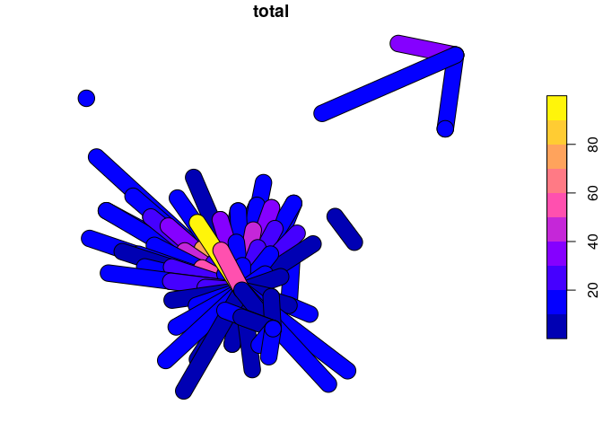<!-- -->

## 6.3 Cycle Routes between flow areas

I have had a play but perhaps this is something you could do? I would
like to - download cycle routes - compare these with flows - identify
origin - destination pairs that could benefit from improved cycle routes

I have has a play below but I am not quite there yet\! from
<https://cran.r-project.org/web/packages/osmdata/vignettes/osm-sf-translation.html>
